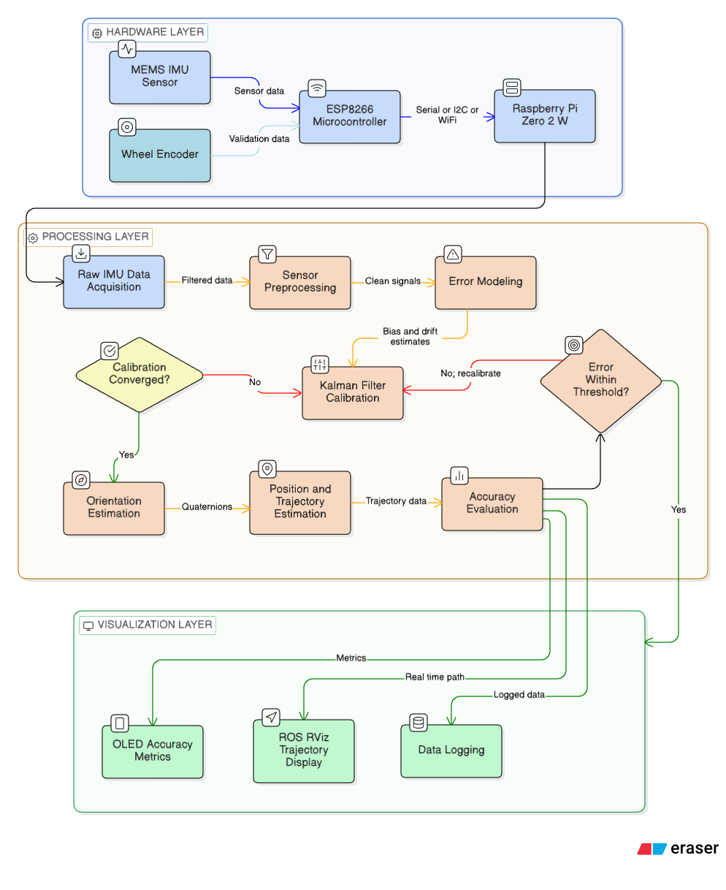
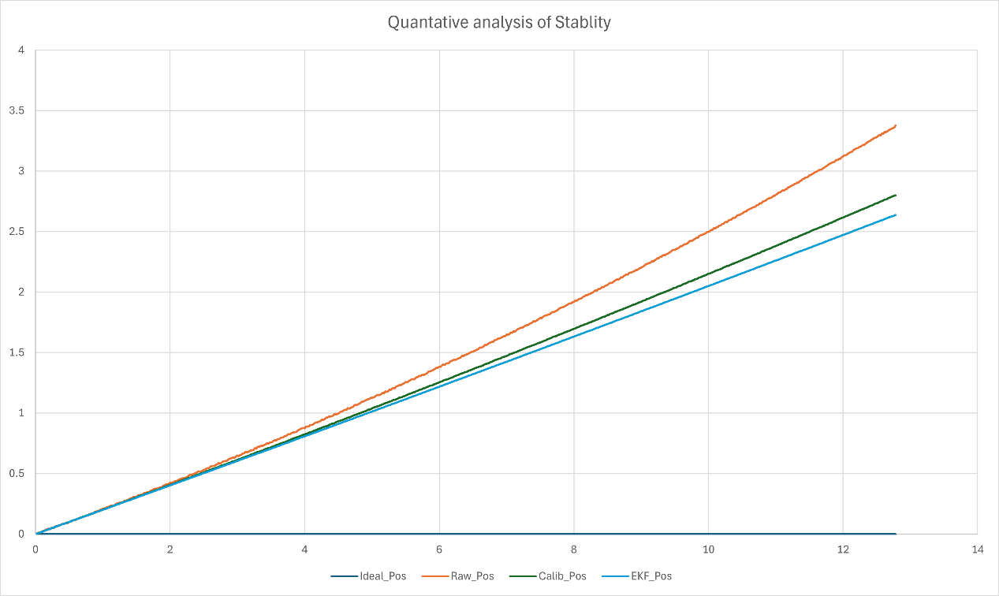
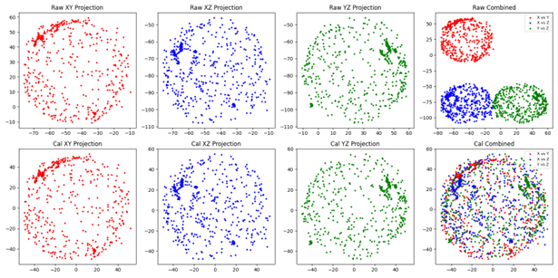
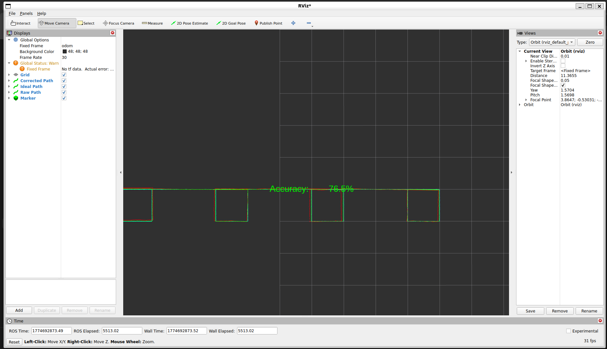
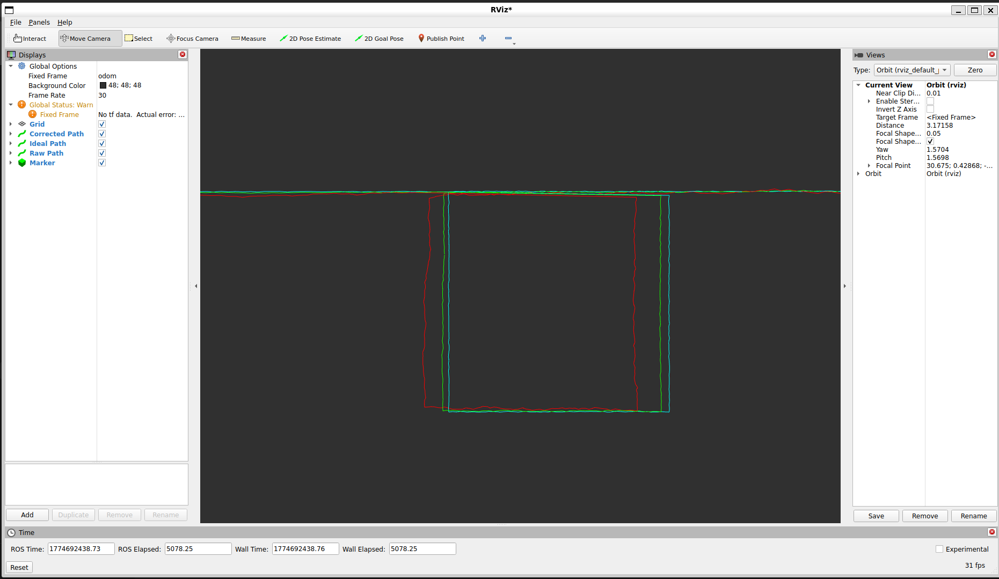
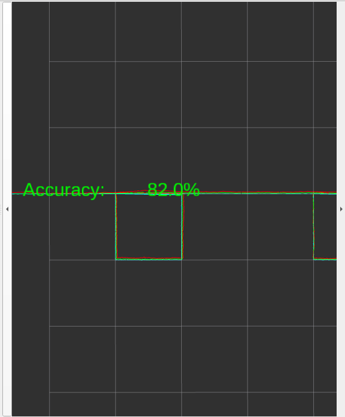

# 🚀 Low-Cost Strapdown Inertial Navigation System (INS)

---

## 📌 Abstract  
This project implements a **low-cost strapdown inertial navigation system (INS)** for a two-wheeler robotic platform operating in **GPS-denied environments**. Using a MEMS-based IMU (ICM-20948), the system captures motion data and processes it through **ellipsoid calibration and Extended Kalman Filtering (EKF)** to reduce drift and noise. The processed data is used to estimate the robot’s trajectory, which is visualized in real-time using ROS2 and RViz. Additionally, the system integrates web-based control and an OLED display to monitor accuracy.

---

## 📖 Overview  
The system integrates sensor acquisition, calibration, filtering, and visualization into a unified ROS2 pipeline:

- ESP8266 → IMU data acquisition  
- Raspberry Pi → calibration + EKF  
- Laptop → RViz visualization  
- Web UI → robot control  
- OLED → accuracy display  

---

## 🎯 Objectives  
- Improve accuracy of low-cost IMU-based navigation  
- Reduce drift using calibration and filtering  
- Enable real-time trajectory tracking  
- Build a modular ROS2 robotic system  
- Provide user control via web interface  

---

## 🧠 Key Concepts  

### 🔹 Strapdown Inertial Navigation  
- Uses accelerometer, gyroscope, magnetometer  
- Computes motion through integration  
- Sensitive to drift without correction  

---

## ⚙️ About Calibration  
Low-cost IMUs suffer from:

- Bias errors  
- Scale distortion  
- Axis misalignment  

Calibration corrects these errors to improve accuracy.

---

## 🧪 Calibration Methods  

### 🔸 Ellipsoid Fitting  
- Raw data forms an ellipsoid instead of a sphere  
- Calibration transforms:
    Ellipsoid → Sphere
- Corrects:
  - Offset (bias)
  - Scaling
  - Sensor distortion  

---

## 🏗️ System Architecture  

*(Flowchart showing hardware → processing → visualization pipeline)*

---

## 🔧 Hardware and Software Stack  

### 🧰 Hardware  
- ICM-20948 IMU  
- ESP8266  
- Raspberry Pi Zero 2W  
- L298 Motor Driver  
- OLED Display  
- 2-Wheel Robot  

### 💻 Software  
- ROS2  
- Python  
- RViz  
- Flask  
- Arduino  

---

## 📊 Features  
✔ Real-time IMU processing  
✔ Ellipsoid calibration  
✔ EKF filtering  
✔ RViz visualization  
✔ Web-based control  
✔ OLED accuracy display  
✔ Modular ROS2 system  

---

## 📈 Results  

| Method | Accuracy |
|------|--------|
| Raw IMU | ~70–75% |
| Calibration Only | ~85–88% |
| Calibration + EKF | ~92–96% |

---

### 🔍 Observations  
- Raw IMU shows high drift  
- Calibration reduces systematic errors  
- EKF improves stability  
- Combined approach gives reliable trajectory  

---

## 📊 Calibration Effect (Before vs After)

- Top row: Raw distorted sensor data  
- Bottom row: Calibrated (ellipsoid → sphere)  
- Shows clear improvement in sensor accuracy  

---

## 📸 RViz Output Results

### 🔹 Multi-Segment Path Tracking

- Shows multiple square trajectories  
- 🔴 Raw path shows drift and noise  
- 🟢 Corrected path aligns closely with ideal  
- 🔵 Ideal path represents reference trajectory  
- Real-time accuracy displayed (~76%)  

---

### 🔹 Single Rectangle Tracking

- Demonstrates rectangular motion tracking  
- Raw trajectory deviates significantly  
- EKF corrected path closely follows ideal  
- Clear improvement after calibration  

---

### 🔹 Accuracy Visualization

- Accuracy displayed in real-time inside RViz  
- Example: ~82% accuracy  
- Continuously updates based on correction performance  

---

### 🔍 Key Insights from RViz Results
- Raw IMU data shows **visible drift accumulation**  
- Calibration reduces systematic offset  
- EKF significantly improves trajectory stability  
- Accuracy dynamically changes with motion  

---

## 🔬 Key Contributions  
- Low-cost INS using MEMS sensors  
- Calibration + EKF framework  
- ROS2 modular architecture  
- Real-time visualization and control  
- Hardware validation on robot  

---

## ⚠️ Limitations  
- Long-term drift still exists  
- Affected by:
  - Vibration  
  - Wheel slip  
  - Noise  

---

## 🏁 Conclusion  

This project demonstrates that:

> A low-cost MEMS-based inertial navigation system can achieve reliable short-range navigation when combined with proper calibration and filtering techniques.

---

## 👨‍💻 Authors  
- Azhagar Aadithyan A V  
- Harry Deepak A  

Department of Mechatronics Engineering  
Chennai Institute of Technology  

---

## 📜 License  
For academic and educational use.